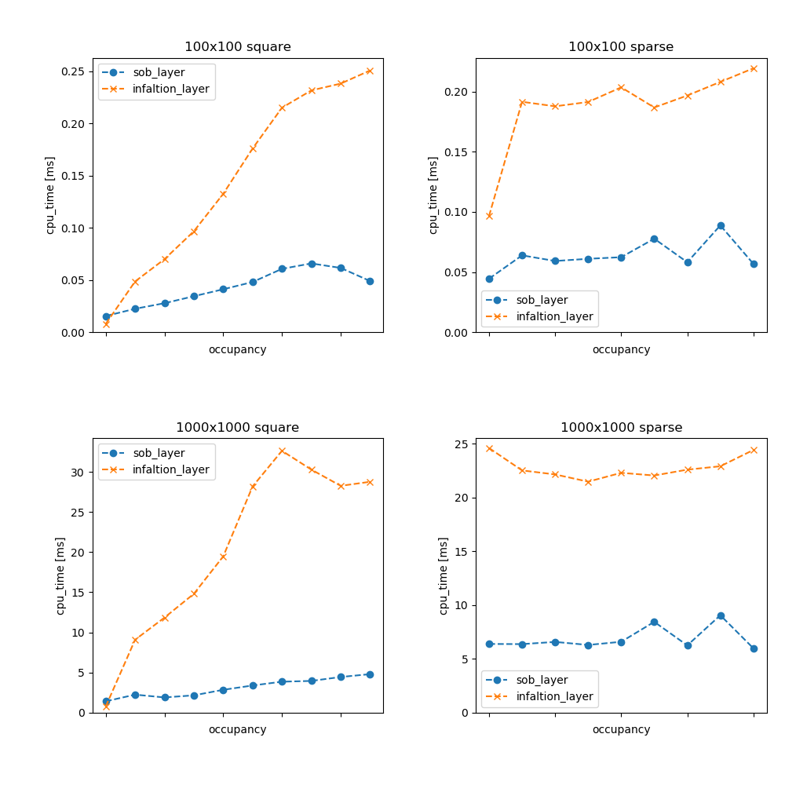

# Small-Objects-Big (Sob) Layer

[](https://travis-ci.com/dorezyuk/sob_layer)

The SobLayer offers a (likely) faster alternative to the
commonly used [costmap_2d::InflationLayer](http://wiki.ros.org/costmap_2d/hydro/inflation). It implements the distance transform algorithm described by Felzenszwalb and Huttenlocher [1].

## Install/Build

If you're using ros-noetic, you can install the package via apt:
```
sudo apt install ros-noetic-sob-layer
```

If you're using an older ros-version or if you want to build the package from sources, follow the "normal" build process for catkin-based packages:

```
cd ~/catkin_ws/src
git clone https://github.com/dorezyuk/sob_layer.git
catkin build sob_layer --no-deps --cmake-args -DCMAKE_BUILD_TYPE=Release
```

You will get an additional performance boost by compiling with O3 optimization,
which enables auto-vectorization:
```
catkin build sob_layer --no-deps --cmake-args -DCMAKE_BUILD_TYPE=Release -DCMAKE_CXX_FLAGS="-O3 -march=native"
```

The library offers also a benchmark-target.
The benchmarking should help you to figure out, if the
SobLayer offers a reasonable improvement over the costmap_2d::InflationLayer for your specific usecase/platform.
The benchmark-target requires the [benchmark](https://github.com/google/benchmark) library.
If you want to build it, add `-Dsob_layer_BENCHMARK=ON` to your build command:
```
catkin build sob_layer --no-deps --cmake-args -DCMAKE_BUILD_TYPE=Release -Dsob_layer_BENCHMARK=ON
```

## Requirements
The library requires at least C++11.
It has been tested on Ubuntu 18.04 and Ubuntu 20.04 running ros-melodic and ros-noetic, respectively.
Following compilers are known to work
* GCC 7.5.0
* Clang 6.0.0


## Benchmarks

This library was benchmarked against the costmap_2d::InflationLayer.
The benchmarks focus on two extreme scenarios. 

In the first scenario we measure the performance of large, connected obstacles.
We place a filled square in the middle of the map.
The square is set to the size NxN. N ranges from 0 to 0.9 times the overall map's
edge E (assuming the map is a square with the size ExE). An increasing N increases hence the "load-factor" (number of occupied cells).

In the second scenario we measure the performance of unconnected obstacles.
On an flattened map, we mark every N-th cell as occupied.
With decreasing values for N, more cells are marked as occupied - our "load-factor" increases.
The used N-values are [101, 51, 41, 31, 21, 11, 6, 3, 2].



The image above shows the results. 
The results were obtained on a AMD Ryzen 5 PRO 4650U CPU.
The library was compiled with GCC 7.5.0 and "-O3 -march=native" flags.

The y-axis indicates the cpu-time. The
x-axis shows the "load-factor" (increasing from left to right).
Both scenarios were run for two map-sizes: 100x100 and 1000x1000.
The upper row shows the results for the first scenario, the lower for the
second.


## Config

The SobLayer follows mostly the configuration from costmap_2d::InflationLayer,
easing the change for users.

```yaml
# in your <common|local|global>_costmap.yaml
plugins:
    # ...
    -{name: inflation_layer,  type: "sob_layer::SobLayer"}

inflation_layer:
    # in meters. positive will suppress the automatic calculation from the
    # footprint
    inflation_radius: -1.
    # in meters, as in costmap_2d::InflationLayer
    inscribed_radius:  1.
    # decay, as in costmap_2d::InflationLayer
    cost_scaling_factor: 0
    # same behavior as in every costmap_2d::Layer:
    # calls to updateCosts and updateBounds will be skipped, if false
    enabled: true

```

## Remarks

Currently this layer does **not** support unknown costs (`costmap_2d::NO_INFORMATION`).
It will treat those costs as lethal.
Consequently, the `inflate_unknown` parameter from the original costmap_2d::InflationLayer
is not supported.

## References

[1] Felzenszwalb, P., & Huttenlocher, D. (2012). Distance Transforms of Sampled Functions *Theory of Computing*, 8(19), 415–428.
